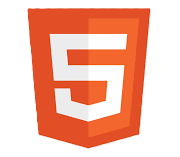
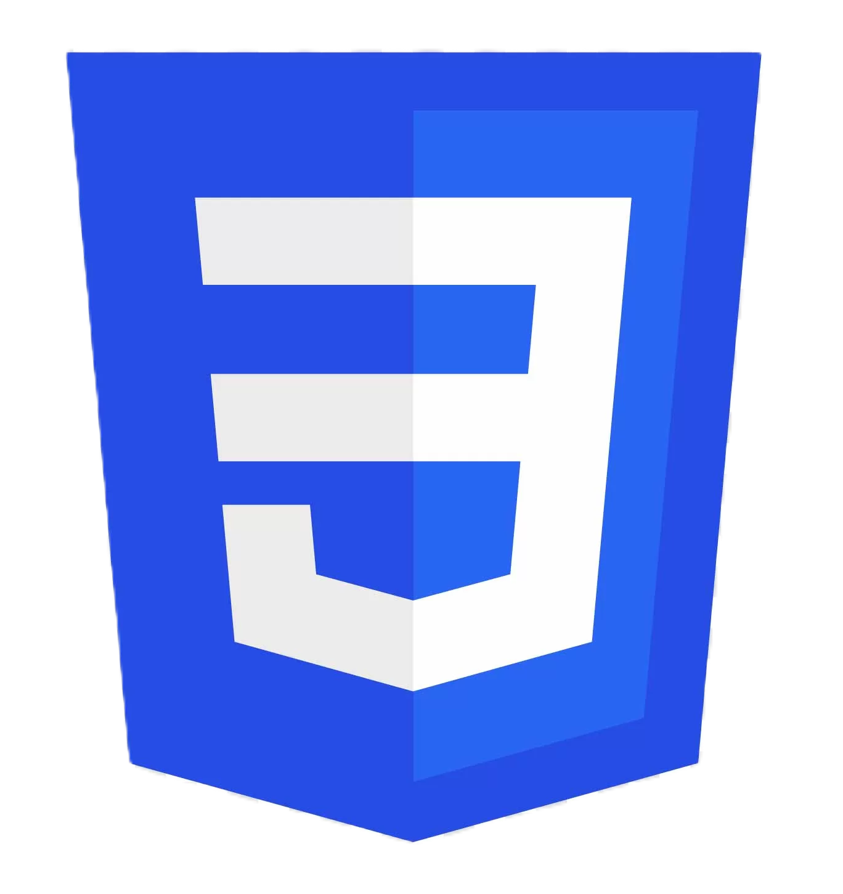
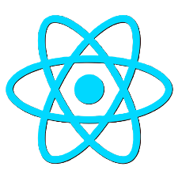
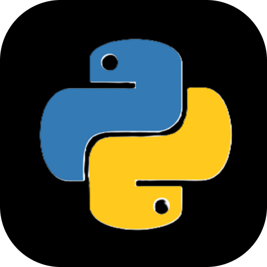
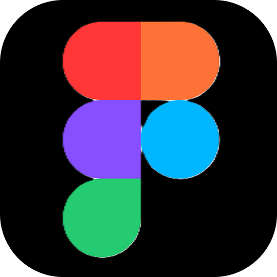
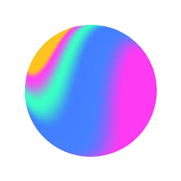
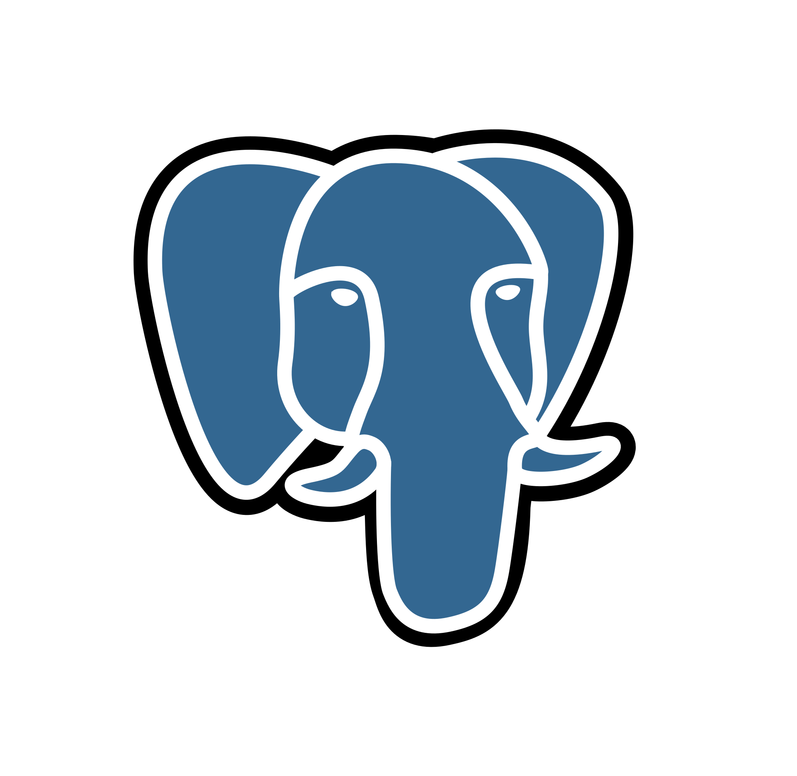
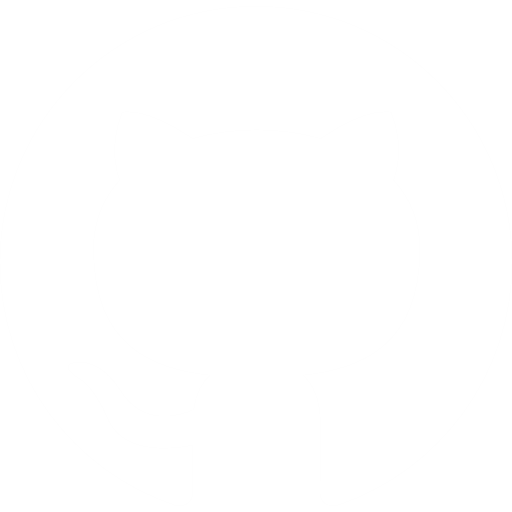
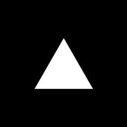

  

  <a href="https://dhakshina-portfolio.web.app/" target="_blank"><b><kbd>Portfolio</kbd></b></a> &nbsp;&nbsp;•&nbsp;&nbsp; 
  <a href="https://linkedin.com/in/dhakshina" target="_blank"><b><kbd>LinkedIn</kbd></b></a> &nbsp;&nbsp;•&nbsp;&nbsp; 
  <a href="https://www.youtube.com/@varnajalamminicrafts" target="_blank"><b><kbd>YouTube</kbd></b></a>

# About Me

<td width="100%" valign="top">

I build, break, and rebuild ideas until they become something meaningful. What started as curiosity about how digital experiences work quickly turned into a habit: exploring new technologies, experimenting with ideas, and constantly pushing each project to be better than the last. For me, every project is an upgrade over the previous one.

I don't just build interfaces - I shape how people experience technology. 

</td>

## Skills & Technologies

   &nbsp;
   &nbsp;
   &nbsp;
   &nbsp;
   &nbsp;
  

   &nbsp;
   &nbsp;
   &nbsp;
   &nbsp;
   &nbsp;
  

