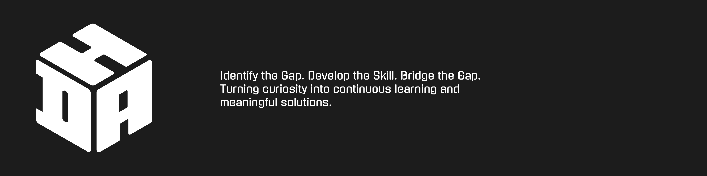
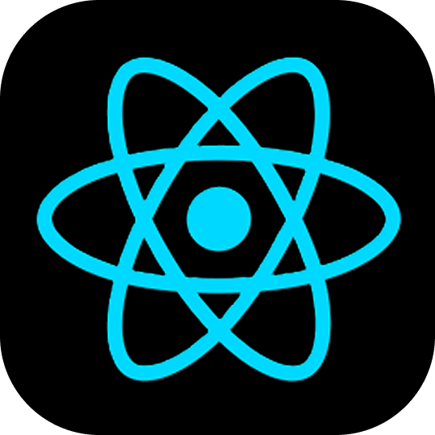
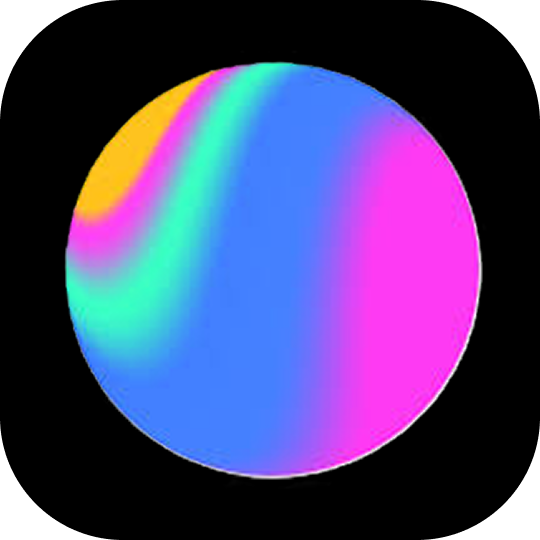
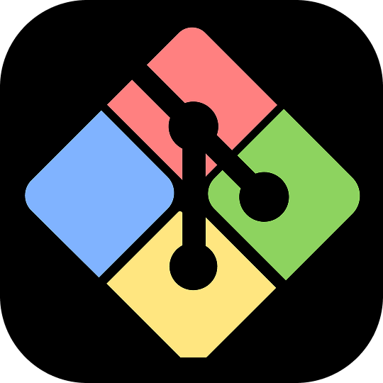

  

  <a href="https://dhakshina-portfolio.web.app/" target="_blank"><b><kbd>Portfolio</kbd></b></a> &nbsp;&nbsp;•&nbsp;&nbsp; 
  <a href="https://linkedin.com/in/dhakshina" target="_blank"><b><kbd>LinkedIn</kbd></b></a> &nbsp;&nbsp;•&nbsp;&nbsp; 
  <a href="https://www.youtube.com/@varnajalamminicrafts" target="_blank"><b><kbd>YouTube</kbd></b></a>

  

#

<h4 align="center" font="bold">About Me</h4>

I build, break, and rebuild ideas until they become something meaningful. What started as curiosity about how digital experiences work quickly turned into a habit: exploring new technologies, experimenting with ideas, and constantly pushing each project to be better than the last. For me, every project is an upgrade over the previous one.

 

I don't just build interfaces—I shape how people experience technology.

#

<h4 align="center" font="bold">Skills & Technologies</h4>

   &nbsp;
   &nbsp;
   &nbsp;
   &nbsp;
   &nbsp;
   &nbsp;
   &nbsp;
   &nbsp;

   &nbsp;
   &nbsp;
   &nbsp;
   &nbsp;
   &nbsp;
   &nbsp;
   &nbsp;
  

# 

<h4 align="center" font="bold">Experience</h4>

<h3 align="center" font="bold"> Web Developer Intern | Blacklight Technologies</h3>
<h4 align="center" font="bold">September 2025 – Present</h4>

Contributed to the design and development of client websites by combining web design, branding, and UI/UX principles. Built responsive websites using React with reusable, scalable components and transformed design concepts into production-ready web applications. Integrated Firebase for data storage, designed logos and branding assets, and deployed websites to hosting platforms. Gained hands-on experience in frontend development, responsive design, and delivering seamless user experiences across desktop, tablet, and mobile devices.

#

